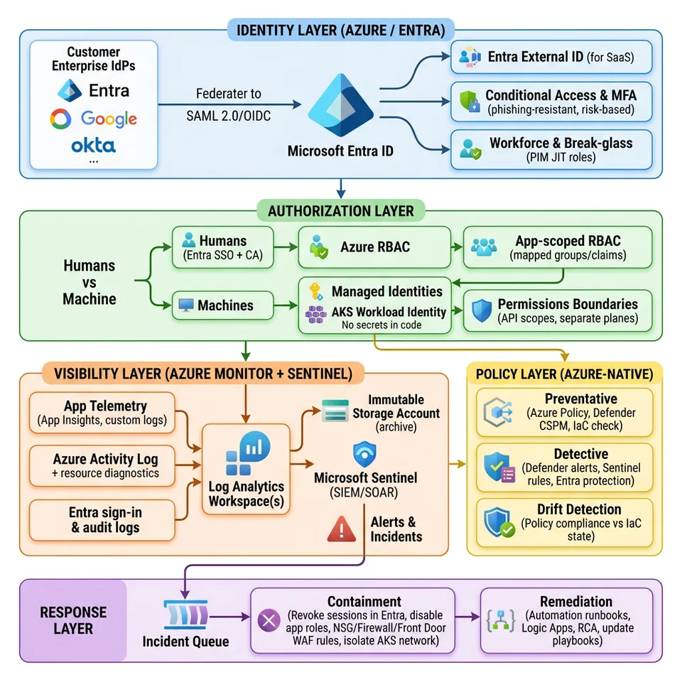

# A10 — Secure Infrastructure Proposal (Olivie)

## Scenario

You are consulting for a mid-sized SaaS company expanding into a regulated market (**education**). They currently have a basic cloud setup with minimal security controls. They must now support:

- Third-party SSO for enterprise customers
- Least-privilege access control
- Audit log retention
- External compliance audit readiness
- Weekly deployment cadence

**Platform assumption:** Primary workloads run on **Microsoft Azure** (identity, logging, policy, and detection use first-party Azure services).

---

## Part A — Architecture Diagram (Mermaid)

The diagram below is a **logical** view: **Microsoft Entra ID** (including External ID patterns where needed) anchors identity and federation; **Azure RBAC** and app permissions enforce least privilege; **Azure Monitor** and **Microsoft Sentinel** centralize visibility; **Azure Policy** and **Defender for Cloud** supply guardrails; response ties **Sentinel** incidents to runbooks and Azure-native containment.

**How to read it**

| Layer             | Azure-focused choices                                                                                                                                                                                                                                                                                                                                                                                                                                                           |
| ----------------- | ------------------------------------------------------------------------------------------------------------------------------------------------------------------------------------------------------------------------------------------------------------------------------------------------------------------------------------------------------------------------------------------------------------------------------------------------------------------------------- |
| **Identity**      | **IdP:** Customer IdPs federate into **Microsoft Entra** via **SAML 2.0 or OIDC** (common in education: **Entra ID**, Google Workspace, Okta). **Federation:** Use **Entra External ID** (or a multitenant enterprise app) as the SaaS identity plane; **SCIM** provisioning into **Entra** for users/groups. **MFA:** **Conditional Access** + **Microsoft Entra multifactor authentication**; **Authentication Strength** for phishing-resistant methods on privileged paths. |
| **Authorization** | **Azure RBAC** for cloud operations; **app roles / enterprise applications** mapping to tenant RBAC. **Machines:** **Managed identities** (App Service, Functions, VMs) and **Azure AD workload identity** on **AKS** instead of embedded secrets.                                                                                                                                                                                                                              |
| **Visibility**    | **Diagnostic settings** → **Log Analytics**; **Entra** sign-in and audit logs ingested; **Application Insights** for app telemetry. **Microsoft Sentinel** for correlation, retention policies, and **workbooks**. Optional **immutable** **Storage** for compliance archive.                                                                                                                                                                                                   |
| **Policy**        | **Azure Policy** at **management group** root (deny public storage, require TLS, approved regions). **Defender for Cloud** for posture and alerts. **Drift:** **Policy compliance** + IaC **plan** in CI.                                                                                                                                                                                                                                                                       |
| **Response**      | **Sentinel** incidents and **Defender** alerts; containment using **Entra** session revocation, **Azure Firewall** / **NSG** rules, **Front Door** WAF, and app-level tenant kill switches.                                                                                                                                                                                                                                                                                     |

---

## Part B — Compliance Mapping Table

Mapping **at least five** requirements to **technical controls** using **primarily Azure services**. Rows cover **identity**, **visibility**, and **policy** (course arcs).

| Requirement                                                     | Technical control                                           | Tool / practice                                                                                                                  | Evidence                                                                |
| --------------------------------------------------------------- | ----------------------------------------------------------- | -------------------------------------------------------------------------------------------------------------------------------- | ----------------------------------------------------------------------- |
| **Identity — Restrict access to authorized users**              | SSO + MFA; least-privilege roles; break-glass only with PIM | **Entra ID** enterprise apps; **Conditional Access** requiring MFA; **Privileged Identity Management** for admins                | CA policy export; PIM activation history; **Entra** sign-in logs sample |
| **Identity — Unique accountability for administrative actions** | Named users; JIT elevation; admin actions auditable         | **PIM** role assignments; **Azure RBAC** at minimum scope; app audit events to **Log Analytics**                                 | Entra audit logs + Azure Activity Log + app audit query results         |
| **Visibility — Retain security and access logs for review**     | Central retention and archive                               | **Log Analytics** retention; **Diagnostic settings** on all subscriptions; archive to **Storage** with **immutability** / policy | Workspace retention blade; storage lifecycle & legal hold docs          |
| **Visibility — Monitor for unauthorized or anomalous activity** | Correlation and alerting                                    | **Microsoft Sentinel** analytics rules; **Microsoft Entra ID Protection**; **Defender for Cloud** alerts                         | Sentinel rule definitions; 90-day incident history in Sentinel          |
| **Policy — Enforce secure baseline configuration**              | Policy-as-code at scale                                     | **Azure Policy** initiatives assigned to **management groups**; IaC (**Bicep** / Terraform) with PR validation                   | Policy compliance dashboard; noncompliance export from **Policy**       |
| **Policy — Detect and respond to configuration drift**          | Continuous evaluation vs desired state                      | **Azure Policy** periodic scan; IaC pipeline **what-if** / plan vs live                                                          | Policy remediation tasks; pipeline logs showing failed drift            |

---

## Part C — Incident Response Outline (one scenario)

**Scenario:** An attacker obtains a **valid OAuth refresh token** (phished or leaked from a developer endpoint) and uses it to call the SaaS API hosted on Azure from an unusual region, exfiltrating tenant metadata.

| Phase           | Detail                                                                                                                                                                                                                                                                                                                                                |
| --------------- | ----------------------------------------------------------------------------------------------------------------------------------------------------------------------------------------------------------------------------------------------------------------------------------------------------------------------------------------------------- |
| **Detection**   | **Microsoft Sentinel** analytics rule: high volume of **Application Insights** / custom API logs to `/admin/**` from a **new country**, correlated with **Entra sign-in** anomalies. Secondary: **Entra ID Protection** risky user / risky sign-in.                                                                                                   |
| **Evidence**    | **Log Analytics**: app traces and custom audit tables; **Entra** sign-in & audit logs; **Azure Front Door** / **Application Gateway** access logs if exposed; **Defender for Cloud** timeline. Export **Sentinel** incident workbook and preserve **immutable** copy to **Storage** if legal hold applies.                                            |
| **Containment** | **Revoke refresh tokens** and **sign out all sessions** for the user in **Entra**; **disable** enterprise app role assignment temporarily; **Azure Front Door WAF** / **Firewall** geo block on abusive IPs; **rate limit** at API Management or app gateway; disable compromised **app registration** secret if applicable.                          |
| **Remediation** | **Conditional Access** with **named locations** / **impossible travel**; **Authentication Strength** for admins; **managed identities** in Azure to eliminate static secrets; **Microsoft Defender for DevOps** or equivalent pipeline secret scanning; update **Sentinel** rules and **playbooks** (Logic Apps); customer notification per contract. |

---

## Brief justification of key design decisions and tradeoffs

- **Entra-centric federation:** Schools and districts often already use **Microsoft 365 / Entra**; standard **SAML/OIDC** still covers non-Microsoft IdPs. Tradeoff: **External ID** and **enterprise app** modeling take engineering time but reduce bespoke auth code and improve **auditability** in **Entra** logs.
- **Sentinel + Log Analytics:** Native integration with **Azure** and **Entra** data reduces custom connectors versus a third-party SIEM, but **ingestion cost** must be modeled (tables, retention tiers, archive).
- **Azure Policy at management group scope:** **Preventative** **deny** policies stop entire classes of misconfigurations; pairing with **weekly** releases means **IaC + policy** gates in **Azure DevOps** or **GitHub Actions** instead of manual reviews.
- **Managed identities & workload identity:** Aligns with **least privilege** and avoids secret rotation pain; requires clear **RBAC** design on **Key Vault**, **Storage**, and **AKS** APIs.

---

## Reflection Question

**What tradeoffs did you make to balance security, compliance, cost, and development velocity? What would you add with more time and budget?**

**Tradeoffs:** Standardizing on **Entra**, **Sentinel**, and **Azure Policy** improves **integration** and **audit narrative** (fewer vendors to evidence) but can **lock** operational skills into the Microsoft stack and increase **run-rate** cost if log volume grows quickly. **Weekly deployments** lean on **automated** policy and IaC checks rather than deep manual review each release—velocity with **residual risk** managed through **Sentinel** and **Defender** detection.

**With more time and budget**, I would add: **Microsoft Purview** for data classification lineage in education datasets where applicable; **Customer-Managed Keys** in **Azure Key Vault** for the most sensitive tenants; **red team** assessment of **Conditional Access** bypass paths; **Sentinel** **SOAR** playbooks for more steps automated; and **chaos testing** of **Log Analytics** ingestion during regional failures to prove **audit continuity**.
